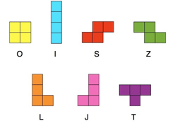

# Tetris Block Placement Algorithms
A repository featuring a set of algorithms used to place Tetris blocks onto a grid.

Pieces to be used:

### Problem Description
Given a grid of size `n` x `m`, a number of pieces equal to (`n`x`m`)/ 4, randomly selected from the pieces shown above, place each piece on to the `n` x `m` board in such a way so that there is no overlap 

### Algorithms
- Algorithm One: Backtracking Search with Forward Checking, Arc Consistency (AC-3), and the Minimum Remaining Values (MRV) Heuristic
- Algorithm Two: Conflict Directed Back-Jumping

### How to Use This Code
- In the Main.java file, the problem is setup at that point. All code needed to run the problem can be found there. 
- There are five variables which can be set, which will alter the experiments to be run:
  - `NUM_ROWS`: The number of rows in the Tetris Board to be generated
  - `NUM_COLS`: The number of columns in the Tetris Board to be generated
  - `NUM_EXPERIMENT_ITERATIONS`: The number of times to run the Algorithms
  - `VERBOSITY`: The amount that each algorithm informs the user of its' current progress. A verbosity of 0 means that the algorithm will just print it's final solution. A verbosity of 1 means that the algorithm will additionally print each time it tries to assign a variable. A verbosity of 2 means that the algorithm will additionally print each variable's domain on variable assignment. 
  - `NUM_PIECES`: Set to (`NUM_ROWS`*`NUM_COLS`) / 4 by default.
- In order to run the experiments, change the variables to what you would like them to be, and then run the Main method in `Main.java`

### Running a Small Problem Instance
- To run a small problem instance, set the variables in `Main.java` equal to the following values:
  - `NUM_ROWS` = 4
  - `NUM_COLS` = 4
  - `NUM_EXPERIMENT_ITERATIONS` = 1
  - `VERBOSITY` = 2
  - `NUM_PIECES` = 3
- This will ensure that there are not many pieces to be placed, that the algorithm will only run once per algorithm type, and that the algorithm will be crystal clear about the domains of each piece as they are being placed. 